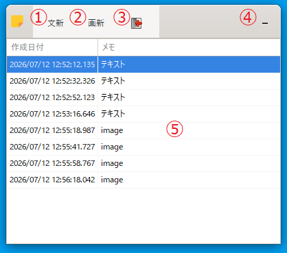
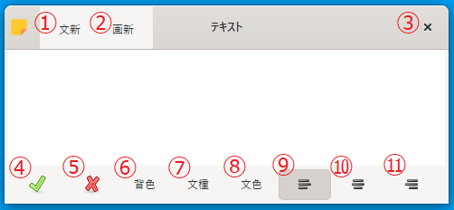
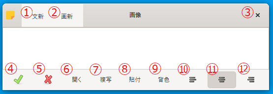
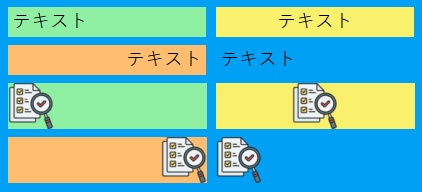
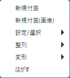
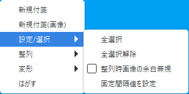
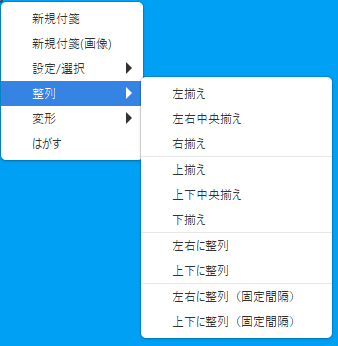
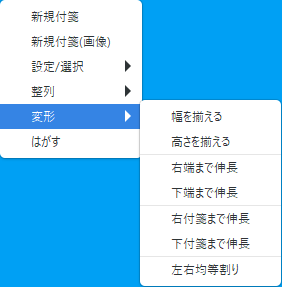

# パワーポイントの「左揃え」のような「整列」機能がある付箋アプリ  

## 1. インストール  

レジストリは使用してないので、任意のフォルダに解凍して下さい。  
アンインストールは、フォルダ毎削除するだけです。  
なお、アプリを実行すると、以下のフォルダ・ファイルが作成されます。  

- imageフォルダ  
  付箋（画像）を作成した場合、画像が保存されるフォルダです。
- fusen.log  
  起動時・終了時などのログが保存されています。アプリが起動しない時などに参照してください。  
  アプリ側で削除をしていないので、ファイルサイズが大きくなった場合、アプリを終了してこのファイルを削除してください。  
- fusen.dat  
  付箋情報を保存したファイルです。  
- fusen.dat.bak  
  fusen.datの1世代前のバックアップファイルです。fusen.datは操作の都度上書きされるので、間違えて付箋を削除した場合などは、他の操作をする前にこのファイルを退避してアプリを終了して下さい。その後、退避したファイルをfusen.datと差し替えてアプリを起動すれば、元に戻せます。  
  ただし、付箋（画像）の場合は、画像ファイルがないとfusen.logにエラーを出力して終了してしまうので、fusen.logでファイル名を確認して、適当な画像ファイルをfusen.logに表示されてるファイル名にリネームして「image」フォルダに置けば、画像は復活しませんが、アプリの起動は可能となります。  

## 2. メイン画面  

  

① 付箋（テキスト）を新規作成するボタン  
② 付箋（画像）を新規作成するボタン  
③ アプリを終了するボタン  
④ メイン画面をタスクトレイに格納するボタン  
⑤ 付箋の作成日付・テキストの内容が表示されます  
　ダブルクリックで付箋編集画面を表示  
　右クリックで右クリックメニューを表示  

## 3. 付箋（テキスト）編集画面  

  

① 付箋（テキスト）を新規作成するボタン  
② 付箋（画像）を新規作成するボタン  
③ 編集画面を閉じるボタン  
④ 編集結果を反映して、編集画面を閉じるボタン  
⑤ 編集画面を閉じるボタン  
⑥ 背景色を変更するボタン  
⑦ フォントを変更するボタン  
⑧ フォントカラーを変更するボタン  
⑨ 文字を左寄せするボタン  
⑩ 文字を中央寄せするボタン  
⑪ 文字を右寄せするボタン  

> [!WARNING]  
> ⑨～⑪は、編集画面上では変化がなく、付箋が作成された後に反映されます。  

## 4. 付箋（画像）編集画面  

  

① 付箋（テキスト）を新規作成するボタン  
② 付箋（画像）を新規作成するボタン  
③ 編集画面を閉じるボタン  
④ 編集結果を反映して、編集画面を閉じるボタン  
⑤ 編集画面を閉じるボタン  
⑥ 画像ファイルを開くボタン  
⑦ クリップボードへ選択範囲の画像をコピーするボタン（Ctrl + C）  
⑧ クリップボードから画像をペーストするボタン（Ctrl + V）  
⑨ 背景色を変更するボタン  
⑩ 文字を左寄せするボタン  
⑪ 文字を中央寄せするボタン  
⑫ 文字を右寄せするボタン  

> [!WARNING]  
> ⑩～⑫は、編集画面上では変化がなく、付箋が作成された後に反映されます。  

> [!NOTE]  
> 画像を開いた後、マウスで領域を指定し、⑦→⑧で指定範囲のみの付箋（画像）が作成できます。  

## 5. 付箋  

  

- 付箋上でダブルクリック：編集画面を起動する  
- 付箋上で右クリック：右クリックメニューを表示する  
- Ctrl + 付箋を左クリック：付箋を選択状態にする  
  ※選択状態になった付箋は赤枠が表示されます  

### 5.1 右クリックメニュー  

  

- 新規付箋：付箋（テキスト）を新規作成する  
- 新規付箋（画像）：付箋（画像）を新規作成する  
- 設定／選択：全選択や整列のための設定を行う  
- 整列：付箋を整列する  
- 変形：付箋を変形する  
- はがす：付箋を破棄する  

### 5.2 右クリックメニュー（設定／選択）  

  

- 全選択：全ての付箋を選択状態にする  
- 全選択解除：全ての付箋の選択状態を解除する  
- 整列時画像の余白無視：「整列」メニューで付箋（画像）を含んで整列する場合、画像以外の領域を無視する  
- 固定間隔値を設定：「左右に整列（固定間隔）」「上下に整列（固定間隔）」の時の付箋間の間隔をピクセル単位で指定する  

> [!NOTE]  
> 「Ctrl + 付箋を左クリック」で個別に選択状態/選択状態解除も可能です。

### 5.3 右クリックメニュー（整列）  

  

- 左揃え：選択状態の付箋を左揃え  
- 左右中央揃え：選択状態の付箋を左右中央揃え  
- 右揃え：選択状態の付箋を右揃え  
- 上揃え：選択状態の付箋を上揃え  
- 上下中央揃え：選択状態の付箋を上下中央揃え  
- 下揃え：選択状態の付箋を下揃え  
- 左右に整列：選択状態の付箋を等間隔で左右に整列  
- 上下に整列：選択状態の付箋を等間隔で上下に整列  
- 左右に整列（固定間隔）：選択状態の付箋を固定間隔で左右に整列  
- 上下に整列（固定間隔）：選択状態の付箋を固定間隔で上下に整列  

### 5.4 右クリックメニュー（変形）  

  

- 幅を揃える：選択状態の付箋のうち最も広い幅に揃える  
- 高さを揃える：選択状態の付箋のうち最も高い高さに揃える  
- 右端まで伸長：選択状態の付箋のうち右端が最も右の座標まで付箋を右に伸ばす  
- 下端まで伸長：選択状態の付箋のうち下端が最も下の座標まで付箋を下に伸ばす  
- 右付箋まで伸長：選択状態の付箋のうち次の付箋の左端まで付箋を右に伸ばす  
- 下付箋まで伸長：選択状態の付箋のうち次の付箋の上端まで付箋を下に伸ばす  
- 左右均等割り：選択状態の付箋のうち最左端と最右端の間で均等な幅になるように幅を調整する  

> [!WARNING]  
> 「左右均等割り」は付箋（画像）に対応してません。  
